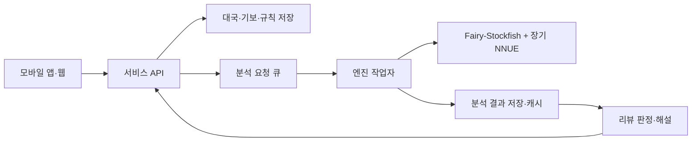

# 장기 AI 분석 앱 실서비스 가능성 검토

작성·자료 확인일: **2026-09-15**  
검토 대상: 한국 장기를 위한 **Fairy-Stockfish + 장기 전용 NNUE**  
검토 방법: 공식 문서·소스·배포 이력 조사 및 Windows 공개 배포본의 기본 동작 시험

## 1. 결론

**일반 장기 이용자를 대상으로 수 추천·후속 수순 탐색·대국 후 복기를 제공하는 앱은 현재 공개 엔진으로 개발할 수 있다. 별도의 장기 AI를 처음부터 학습시키는 것은 초기 서비스의 필수 조건이 아니다.**

권고는 **“엔진 채택 및 시제품 개발 진행, 유료 정식 출시는 규칙·리뷰 품질·부하 검증 통과 후”**다. 장기 NNUE가 공개되어 있고, 이를 이용하는 웹서비스 구현 사례가 있으며, 이번 기본 시험에서도 분석 인터페이스가 동작했다. 다만 이것만으로 프로 대상 분석 정확도나 대규모 서비스 품질까지 검증된 것은 아니다. [공식 엔진](https://github.com/fairy-stockfish/Fairy-Stockfish), [NNUE 목록](https://fairy-stockfish.github.io/nnue/), [PyChess 구현](https://github.com/gbtami/pychess-variants)

| 판단 항목 | 결론 | 근거의 수준 |
|---|---|---|
| 장기 엔진 확보 | 가능 | 공개 소스·장기 전용 평가망·실행 파일 확인 |
| 후보 수·추천 수순 제공 | 가능 | UCI 기능 및 이번 실행 시험으로 확인 |
| 일반 이용자용 복기 | 구현 진행 권고 | 엔진 출력 위에 실수 판정·화면·기보 처리가 필요 |
| 프로 기사급 분석 도구 | 별도 검증 필요 | 강한 기력이라는 프로젝트 주장과 제한적 공개 자료가 있음 |
| 자연스러운 한국어 코칭 | 추가 개발 필요 | 수순을 설명하는 별도 해설 시스템이 필요 |
| 상업 서비스 | 라이선스 조건을 지키는 구조로 가능 | 서버 실행과 앱·WASM 배포의 의무가 다름 |
| 운영 원가·수익성 | 아직 확정 불가 | 실제 서버, 이용량, 분석 시간, 과금 정책이 미정 |

**출시의 핵심 과제는 엔진 자체보다 “우리 앱의 장기 규칙에 맞는 분석”과 “이용자가 납득하는 복기”다.** 초기 범위는 **대국 후 리뷰 + 자유 분석판 + 학습 모드 수 추천**으로 잡는 것을 권한다.

이 문서에서 **확인 사실**은 출처 또는 실행 결과로 뒷받침한 내용이며, **권고·목표·계산 예시**는 서비스 설계를 위한 제안이다. 시장 규모나 유료 전환율은 조사하지 않았다.

## 2. 어떤 엔진을 사용해야 하나

### 2.1. 대상은 Fairy-Stockfish

Fairy-Stockfish는 Stockfish에서 파생된 변형 체스 엔진이며 한국 장기인 `janggi`를 지원한다. NNUE는 탐색 중 만나는 장면의 유불리를 빠르게 평가하는 작은 신경망이다. 엔진의 수 탐색과 장기용 평가망을 함께 사용한다. [프로젝트 설명](https://github.com/fairy-stockfish/Fairy-Stockfish), [NNUE 설명](https://fairy-stockfish.github.io/about-nnue/)

일반 체스용 Stockfish에 장기 기보만 입력하거나, 중국 샹치용 평가망을 장기에 대신 쓰는 방식으로 접근하면 안 된다. 장기 규칙과 장기 평가망을 명시적으로 선택해야 한다. 공식 기력 문서도 한국 장기와 샹치를 별도 종목으로 다룬다. [종목별 문서](https://github.com/fairy-stockfish/Fairy-Stockfish/wiki/Playing-strength)

### 2.2. 조사 시점에 확인한 버전

| 항목 | 확인 내용 |
|---|---|
| 공식 목록의 장기 평가망 | `janggi-9991472750de.nnue` |
| 평가망 목록의 날짜 | 2025-07-31 |
| 확인한 장기 전용 배포 태그 | `janggi-9991472750de-new` |
| 해당 배포 게시일 | 2025-08-12 UTC, GitHub API 메타데이터로 확인 |
| 이번 시험의 엔진 식별 문자열 | `Fairy-Stockfish 120825 LB` |
| 해당 태그의 엔진 소스 서브모듈 | `a0b277d7abfe6094bd44da4b113b00a94f0325a1` |
| 본체 개발 이력 | 2026-09-06의 `226c7f1` 커밋 확인 |

출처: [NNUE 목록](https://fairy-stockfish.github.io/nnue/), [시험한 장기 배포](https://github.com/fairy-stockfish/Fairy-Stockfish-NNUE/releases/tag/janggi-9991472750de-new), [배포의 소스 구성](https://github.com/fairy-stockfish/Fairy-Stockfish-NNUE/tree/janggi-9991472750de-new), [2026년 본체 커밋](https://github.com/fairy-stockfish/Fairy-Stockfish/commit/226c7f18c854372d5612be2a7d7f14449ae5a239)

**본체의 릴리스 번호, 개발 브랜치, 장기 평가망의 날짜는 서로 다르다.** 본체 릴리스 목록에 오래된 14 계열이 보인다고 개발 중단으로 판단해서도 안 되고, 2025년 장기 실행 파일에 2026년 소스 변경이 반영되었다고 가정해서도 안 된다. [본체 릴리스 목록](https://github.com/fairy-stockfish/Fairy-Stockfish/releases)

운영 시에는 `엔진 소스 커밋 + NNUE 해시 + 빌드 옵션 + 규칙 버전`을 하나의 분석 버전으로 고정한다. 새 버전은 기존 평가 사례를 다시 확인한 뒤 배포한다.

## 3. 현재 기력은 서비스에 충분한가

### 3.1. 강한 엔진이라는 근거는 있지만 절대 등급은 단정할 수 없다

1. **프로젝트 측 설명:** 공식 기력 위키는 NNUE 장기 엔진을 프로 선수보다 강한 수준으로 설명한다. 다만 해당 페이지의 편집일은 2024-04-11이며, 이것은 개발 프로젝트의 평가다. 독립 기관이 현재 배포본의 절대 등급을 인증했다는 뜻은 아니다. [기력 위키](https://github.com/fairy-stockfish/Fairy-Stockfish/wiki/Playing-strength)
2. **공식 목록의 상대 기력:** 2025년 장기 NNUE에 `+1128 Elo`가 기재되어 있다. 비교 기준은 **NNUE를 쓰지 않는 수작업 평가 함수**다. 인간 기사보다 1128점 높다는 의미도, 한국 장기 앱의 레이팅에 더할 수 있는 값도 아니다. 해당 행만으로 전체 대국 수·신뢰구간까지 확인되지는 않는다. [평가망 목록과 비교 기준](https://fairy-stockfish.github.io/nnue/)
3. **과거의 정량 실험:** 2021년 14.0.1 XQ 배포 자료에는 장기에서 기존 평가 대비 200국씩 비교한 결과가 있다. 짧은 시간 조건은 약 `+350 ±73 Elo`, 더 긴 조건은 약 `+298 ±67 Elo`로 보고했다. NNUE 개선 효과의 근거지만, 2025년 평가망의 최신 기력 시험으로 사용해서는 안 된다. [당시 배포·시험 결과](https://github.com/fairy-stockfish/Fairy-Stockfish/releases/tag/fairy_sf_14_0_1_xq)

**판단:** 일반 이용자의 학습·복기를 위한 초기 엔진으로 채택할 근거는 충분하다. “국내 프로 9단 상당”, “세계 최강”, “추천 수는 항상 정답” 같은 문구를 서비스의 보증으로 사용하는 것은 근거가 부족하다. 이번 조사에서 최신 배포본을 대상으로 한 독립적인 대규모 프로 대국 평가표는 확보하지 못했다.

### 3.2. 기력이 높아도 남는 한계

- 제한된 시간의 탐색은 긴 희생 수순이나 조용한 방어 수를 놓칠 수 있다. 초기 배치에서 빠르다는 사실만으로 중·종반의 정확도를 추정할 수 없다.
- 탐색 시간이 늘면서 1순위 수가 바뀔 수 있다. 비슷한 후보가 여럿이면 한 수만 정답으로 취급하지 않는 편이 적절하다.
- 공개 이슈에는 장기 전술 누락과 외통 탐색 문제가 남아 있다. 각각 2020년에 등록된 사례이므로, **현재 NNUE에서도 같은 문제가 재현된다는 뜻으로 해석하지 않는다.** 출시 전 회귀 시험에 포함할 후보로 사용한다. [전술 이슈 #107](https://github.com/fairy-stockfish/Fairy-Stockfish/issues/107), [외통 이슈 #212](https://github.com/fairy-stockfish/Fairy-Stockfish/issues/212)
- 체스의 Syzygy 종반 데이터베이스 기능을 장기 완전해결 기능으로 간주할 수 없다. 확인한 탐색 소스에는 해당 조회를 체스 규칙으로 제한하는 조건이 있다. [탐색 소스](https://github.com/fairy-stockfish/Fairy-Stockfish/blob/226c7f18c854372d5612be2a7d7f14449ae5a239/src/search.cpp)

## 4. 이번에 직접 확인한 실행 결과

### 4.1. 시험 조건

- Windows, Intel Core Ultra 5 225H.
- 공식 장기 배포의 범용 `fairy-stockfish_x86-64.exe` 사용. 별도 CPU 명령어 최적화 빌드와 비교하지 않았다.
- `Threads=1`, `Hash=128` MiB, `Use NNUE=true`.
- 각 규칙의 기본 초기 배치, 각 조건 1회. 기본 탐색끼리는 `ucinewgame`으로 초기화했다.
- 각 탐색에서 `NNUE evaluation using janggi-9991472750de.nnue enabled` 메시지를 확인했다.

### 4.2. 관측값

| 규칙 | 후보 수 개수 | 요청 탐색 시간 | 엔진 보고 시간 | 탐색 노드 수 | 반환한 최선 수 |
|---|---:|---:|---:|---:|---|
| `janggi` | 3 | 1,000 ms | 1,004 ms | 281,263 | `a4b4` |
| `janggimodern` | 3 | 1,000 ms | 1,002 ms | 261,056 | `b1c3` |
| `janggitraditional` | 3 | 1,000 ms | 1,004 ms | 257,807 | `b1c3` |
| `janggicasual` | 3 | 1,000 ms | 1,007 ms | 201,893 | `b1c3` |
| `janggi` | 1 | 1,000 ms | 1,003 ms | 186,787 | `a4b4` |
| `janggi` | 1 | 3,000 ms | 3,008 ms | 660,761 | `a4b4` |

추가로 `searchmoves a4b4`를 통한 첫 수 제한 탐색이 동작했고, `go perft 1`에서 기본 장기 초기 배치의 합법 수 32개와 한수쉼 표현 `e2e2`를 확인했다. 이는 엔진의 출력 확인이며 독립적인 전체 규칙 검증은 아니다.

**이 결과가 보여 주는 것:** 공개 배포본으로 NNUE를 적용한 장기 분석, 여러 후보와 후속 수순 출력, 지정 수 검토를 연결할 수 있다. 이번 탐색은 GPU 없이 CPU로 실행했다.

**이 결과가 보여 주지 않는 것:** 실제 이용자의 기보 분석 정확도, 프로 대비 기력, 모바일 속도, Linux 서버 처리량, 동시 요청 지연. 표의 시간에는 앱 통신·대기열·엔진 시작 시간이 포함되지 않는다. 순차 1회 시험이며 CPU 코어 고정이나 시스템 부하 통제를 하지 않았으므로 조건 간 우열 비교에도 사용하지 않는다.

재현용 배포 식별 정보:

```text
release: janggi-9991472750de-new
asset: fairy-stockfish_x86-64.exe
size: 13314048 bytes
SHA256: d9fd87ae91f2226d741d436d5dbc548416c66d77297e84ef7ee8fbe2a9d29e50
```

## 5. 요청한 기능별 구현 가능성

다음은 엔진 출력과 별도 제품 개발의 경계를 정리한 설계 판단이다. UCI는 앱이 엔진에 명령을 보내고 결과를 받는 텍스트 규약이며, PV는 엔진이 예상하는 주요 후속 수순, MultiPV는 여러 후보 수순을 뜻한다. [명령어 문서](https://github.com/fairy-stockfish/Fairy-Stockfish/wiki/Command-line), [옵션 구현](https://github.com/fairy-stockfish/Fairy-Stockfish/blob/226c7f18c854372d5612be2a7d7f14449ae5a239/src/ucioption.cpp)

| 사용자 기능 | 엔진에서 얻는 것 | 앱에서 개발할 것 | 초기 출시 권고 |
|---|---|---|---|
| 다음 수 추천 | `bestmove`, 평가값 | 화살표, 좌표·기물 표기, 분석 중 표시 | 포함 |
| 상위 3개 후보 비교 | `MultiPV`, 후보별 PV·점수 | 후보 선택과 예상 수순 재생 | 포함 |
| “이 수를 두면?” 탐색 | 해당 수 이후 국면 탐색 또는 `searchmoves` | 분석 분기, 되돌리기, 상대 최선 응수 표시 | 포함 |
| 대국 후 리뷰 | 각 국면의 평가와 수순 | 기보 순회, 중요 장면 추출, 실수 판정 | 포함 |
| 우세 변화 그래프 | 국면별 수치 | 초·한 관점 통일, 급변 구간 표시 | 포함 |
| “악수·묘수” 라벨 | 라벨의 근거가 되는 수치·수순 | 임계값 보정, 대안 수 비교, 판정 보류 | 제한적으로 포함 |
| “정확도 92점” | 완성된 지표는 없음 | 장기 이용자 데이터로 점수 정의·검증 | 후순위 |
| 한국어 해설 | 평가와 PV라는 설명 근거 | 장기 전술 특징 추출, 문장 생성·검증 | 기본 템플릿부터 |
| 난이도별 AI 대국 | 기력 제한 옵션 | 자연스러운 약한 수, 난이도 체감 보정 | 선택 |

특히 `Skill Level`이나 `UCI_Elo`의 숫자를 한국 장기의 급·단수로 바로 표시하지 않는다. 장기 사용자와의 실제 대국 결과로 난이도 구간을 맞추는 것이 좋다. 엔진은 인위적인 기력 제한 기능을 제공하지만 장기 급·단 인증을 제공하지 않는다. [기력 설정 FAQ](https://github.com/fairy-stockfish/Fairy-Stockfish/wiki/FAQ)

## 6. 국내 장기 규칙 선택이 가장 중요한 통합 작업

### 6.1. 지원하는 네 가지 규칙

| 엔진 규칙 이름 | 빅장 처리 | 기물 점수에 의한 판정 | 사용 판단 |
|---|---|---|---|
| `janggi` | 사용 | 사용 | 공식 문서에서 대회형으로 설명하는 규칙 |
| `janggitraditional` | 빅장을 무승부로 처리 | 미사용 | 전통형 규칙 |
| `janggimodern` | 미사용 | 사용 | 국내 온라인 장기 경험을 지향할 때 우선 비교할 후보 |
| `janggicasual` | 미사용 | 미사용 | 점수 판정을 두지 않는 캐주얼 규칙 |

공식 FAQ는 `janggimodern`을 카카오장기에 대응하는 규칙으로 설명하지만, 이는 2023년 문서다. **현재 특정 국내 서비스와 완전히 일치한다고 단정하지 않는다.** 실제 소스에서도 modern 규칙은 반복 관련 설정을 별도로 갖는다. [규칙 FAQ](https://github.com/fairy-stockfish/Fairy-Stockfish/wiki/FAQ), [규칙 정의 소스](https://github.com/fairy-stockfish/Fairy-Stockfish/blob/226c7f18c854372d5612be2a7d7f14449ae5a239/src/variant.cpp)

### 6.2. 출시 전에 확정·검증할 항목

- **초기 차림:** 마·상 배치 선택을 지원하고, 양측 각 4가지로 만들어지는 16개 조합을 검증한다. 엔진 기본 초기 배치 하나만 서비스하지 않도록 한다. 배치 선택 자체는 앱이 처리하고 확정된 판을 엔진에 전달한다. [PyChess 장기 배치 설명](https://www.pychess.org/variants/janggi)
- **특수 이동:** 마·상의 길막, 포의 이동·포끼리의 관계, 궁성 대각선 이동, 장군 중 가능한 대응을 검증한다.
- **한수쉼·빅장·반복:** 한수쉼 허용 상황, 빅장 대응, 반복 금지·종료, 연속 장군을 앱의 명문화된 규칙과 대조한다.
- **종료 판정:** 기물 점수, 후수 보정, 점수 계산의 발동 조건, 최대 수수, 무승부·시간패를 분리해 정의한다. 단순히 기물이 더 많다는 이유로 승리 처리하지 않는다.
- **수·좌표 단위:** 초·한의 한 번 착수를 각각 1 ply로 저장한다. 10번째 행 좌표 때문에 `a10` 같은 좌표가 생기므로 수 문자열을 항상 4글자로 가정하면 안 된다.
- **기보 이력:** 현재 판만 저장하지 않고 초기 배치와 전체 착수 이력을 함께 보관한다. 같은 배치라도 반복 이력에 따라 합법 수·판정이 달라질 수 있다.

위 목록은 출시 검증 제안이다. 지원 기능의 근거는 [장기 규칙 정의](https://github.com/fairy-stockfish/Fairy-Stockfish/blob/226c7f18c854372d5612be2a7d7f14449ae5a239/src/variant.cpp)와 [좌표·기보 입력 구현](https://github.com/fairy-stockfish/Fairy-Stockfish/blob/226c7f18c854372d5612be2a7d7f14449ae5a239/src/uci.cpp)에서 확인했다.

**규칙이 다르면 최선 수도 달라진다.** 엔진이 무승부로 보는 상황을 앱만 점수승으로 처리하는 식의 차이는 결과 화면만 수정해서 해결되지 않는다. 탐색이 가정하는 종료 조건까지 서비스 규칙과 일치시켜야 한다. 초기에 규칙을 하나로 제한하면 이 검증 범위를 줄일 수 있다.

## 7. 리뷰를 신뢰할 수 있게 만드는 방법

이 절은 권장 구현 방식이다.

### 7.1. 수 추천과 실수 판정은 다른 작업이다

한 장면의 추천 수를 얻는 것은 비교적 간단하다. 사용자의 수가 얼마나 나빴는지 판정하려면 그 수도 충분히 탐색해야 한다.

1. 초기 배치와 실제 기보로 착수 직전 상태를 재구성한다.
2. 제한 없는 탐색으로 유력 후보를 얻는다.
3. 실제 착수가 후보에 없으면 `searchmoves`로 첫 수를 고정해 분석하거나, 실제 착수 이후 상태를 별도 탐색한다.
4. 평가 관점을 동일한 플레이어로 맞춘다. 착수 이후는 상대 차례이므로 부호 반전이 필요할 수 있다.
5. 큰 손실이 의심되는 장면은 후보 수와 실제 수를 모두 더 긴 예산으로 재검토한다.
6. 점수 차이가 작거나 분석이 안정되지 않았으면 단정적인 악수 라벨을 보류한다.

예를 들어 두 평가가 모두 초 관점일 때 추천 수는 `+120`, 실제 수는 `-80`이라면 손실을 `200 cp`로 계산할 수 있다. 이것은 계산 설명용 가상 수치다. 강제승패·외통 표시는 일반 cp 차감과 분리하고, 탐색의 상한·하한 값도 확정 점수와 구분한다.

깊은 탐색의 첫 후보와 얕은 탐색의 실제 수를 그대로 비교하면 손실이 과장될 수 있다. 모든 수를 항상 같은 벽시계 시간만큼 탐색했다고 품질이 같아지는 것도 아니다. 검증 단계에서는 탐색 시간·노드 수·완료 깊이를 함께 기록하고, 판정이 바뀌는 장면을 수집한다.

### 7.2. 평가값·기물 점수·승률은 구분한다

엔진의 `score cp`는 내부 평가를 변환한 수치다. **장기 점수승에 쓰는 기물 점수와 동일한 단위가 아니다.** 확인한 `UCI_ShowWDL` 구현도 fishtest 장시간 대국 자료 기반 모델로 설명되어 있어, 장기 이용자의 실전 승률로 보정되었다는 근거가 없다. [평가값 및 WDL 구현](https://github.com/fairy-stockfish/Fairy-Stockfish/blob/226c7f18c854372d5612be2a7d7f14449ae5a239/src/uci.cpp)

권장 표시 정책:

- 첫 버전은 `초 우세 / 균형 / 한 우세`와 분석 수순 중심으로 제공한다.
- 실제 기물 점수를 보여 줄 경우 `기물 점수`라고 별도 표시한다.
- `승률 83%`는 장기 대국 데이터로 보정한 뒤 제공한다. 인간 승률과 엔진 자가대국 승률도 구분한다.
- 정확도·악수 임계값은 체스 서비스의 수식을 그대로 이식하지 말고 장기 검수 데이터로 정한다.
- 분석 중과 분석 완료를 구분한다. MultiPV의 후보들은 중단 시 서로 다른 깊이의 결과일 수 있다.

### 7.3. 한국어 해설

처음에는 엔진 수순에서 확인 가능한 사실을 템플릿으로 설명하는 편이 검증하기 쉽다. 예를 들어 기물 손실, 상대 장군 대응, 포의 공격선 변화 등을 합법 수 재생으로 확인한 후 문장을 만든다.

LLM을 추가한다면 `국면 + 추천 수 + 상대 최선 응수 + 평가 변화 + 검증된 전술 특징`을 전달한다. LLM이 새 수를 만들어 정답처럼 제시하게 하지 않고, 설명에 등장하는 수는 규칙 검증을 거친다. 기계적으로 확인하기 어려운 장기 전략 해설은 기사·강사 검수 사례를 확보한 뒤 확대한다.

## 8. 권장 서비스 구조

### 8.1. 초기에는 서버에서 엔진 실행

다음 구조를 권한다. 엔진 프로세스를 관리하는 작업자를 별도로 두면 분석 부하를 대국·계정 API와 분리할 수 있다.



| 방식 | 장점 | 고려할 점 | 권고 |
|---|---|---|---|
| 서버 네이티브 엔진 | 이용자별 분석 품질 통일, 버전 관리 용이 | CPU 비용·대기열 운영 필요 | 초기 기본 구조 |
| 브라우저 WASM | 이용자 기기에서 분석해 서버 연산 절약 | 성능·배터리·브라우저 기능 차이, 코드 배포 의무 | 자유 분석판에서 후속 검토 |
| 모바일 네이티브 내장 | 오프라인 기능 가능 | 플랫폼별 빌드·발열·배포 라이선스 검토 | 오프라인 요구가 있을 때 |

WASM은 기술적 가능성만 있는 아이디어가 아니다. 공식 포트는 NNUE와 PyChess의 클라이언트 분석 사용을 명시한다. 다만 이번 조사에서는 Android·iOS·브라우저 실기기 시험을 하지 않았다. [WASM 포트](https://github.com/fairy-stockfish/fairy-stockfish.wasm)

### 8.2. 운영 설계에서 필요한 것

- 초기 작업자 설정은 **프로세스당 Threads 1, Hash 128 MiB** 정도를 비교 시험의 출발점으로 삼는다. 최적값으로 확정한 수치는 아니다.
- 엔진 한 프로세스에는 한 시점에 한 분석을 배정한다. 서로 다른 이용자의 명령·결과가 섞이지 않도록 한다.
- 대국 간 설정과 탐색 상태를 초기화하고, 요청마다 규칙·NNUE 사용 여부를 확인한다.
- 대화형 추천은 짧은 기한으로, 전체 기보 리뷰는 별도 큐에서 처리한다. 취소·시간 초과·작업자 재시작을 지원한다.
- 분석 캐시 키에는 **규칙, 초기 배치, 필요한 착수 이력, 엔진·NNUE 버전, 분석 예산, 후보 수 설정**을 포함한다. FEN 하나만 키로 쓰면 반복 이력 차이를 놓칠 수 있다.
- 기보를 먼저 검증하고, 잘못된 입력이 작업자를 종료시키더라도 대국 서비스까지 영향을 주지 않도록 격리한다.
- 서버의 대국 상태를 기준으로 추천 API 권한을 확인한다. 랭킹 대국 중에는 추천을 막고, 종료 후 리뷰·연습 모드에서 허용하는 제품 정책을 권한다. 외부 엔진 사용까지 완전히 차단한다는 의미는 아니다.
- 작업자 8개가 Hash를 각각 128 MiB 쓰면 Hash만 약 1 GiB다. 실제 메모리에는 평가망·프로세스·큐·API·DB 여유분이 추가된다.

규칙 검증 연동에는 공식 Python 바인딩 등도 후보가 된다. 어떤 언어를 쓰든 서버가 실제 대국 규칙의 기준을 갖고, UI가 제출한 수를 그대로 신뢰하지 않게 설계한다. [공식 API 문서](https://github.com/fairy-stockfish/Fairy-Stockfish/wiki/API)

## 9. 서버 비용과 응답 시간의 현실적인 산정법

**아래 수치는 실측 원가나 클라우드 견적이 아닌 용량 계획 예시다.** 이번 1초 초기 국면 시험으로 전체 기보의 품질·처리량을 외삽하지 않는다.

단일 스레드를 계속 사용하는 작업자의 간단한 계산식:

```text
리뷰 1건의 CPU 사용량 ≈ 기본 분석 횟수 × 기본 시간
                      + 추가 분석 횟수 × 추가 시간

일 CPU 시간 = 일 리뷰 수 × 건당 CPU 초 / 3,600
평균 코어 수 = 일 CPU 시간 / 24
계획 코어 수 ≈ 평균 코어 수 × 피크 배수 / 목표 이용률
```

가정: 기보당 120회 착수의 직전 국면을 각각 0.25초 분석하고, 의심 장면의 실제 수·대안 수 검토를 합해 20회의 추가 탐색을 각각 2초 실행한다.

```text
120 × 0.25 + 20 × 2 = 약 70 CPU초 / 리뷰
```

| 일 리뷰 수 | 일 CPU 시간 | 하루에 고르게 처리할 때 평균 코어 | 피크 3배·이용률 65% 가정의 계획 코어 |
|---:|---:|---:|---:|
| 1,000건 | 약 19.4시간 | 약 0.81개 | 약 4개 |
| 10,000건 | 약 194.4시간 | 약 8.10개 | 약 38개 |

이는 분석 전용 CPU의 대략적인 규모다. 클라우드 vCPU 성능은 이 PC의 코어와 같지 않으며, 여러 스레드로 실행하면 `벽시계 시간 × 실제 CPU 점유`를 측정해야 한다. 실시간 AI 대국·자유 분석 요청도 별도로 더한다.

월 예산은 **실제 서버 수·가동시간·서버 단가 + DB·저장소·네트워크·모니터링 + 선택적 LLM 비용**으로 계산한다. 상시 서버는 일이 없는 시간에도 비용이 발생하므로 위 CPU 사용 시간만으로 청구액을 계산하지 않는다.

운영 권고:

- 빠른 분석 후 중요한 장면만 정밀 재분석한다.
- 무료·유료 차이는 분석 시간, 하루 리뷰 횟수, 저장·학습 기능으로 설계할 수 있다.
- 이용자가 보드에서 이동한 뒤 이전 장면의 분석은 취소한다.
- 기보 전체 결과를 한 번에 기다리게 하기보다 진행률과 완료된 장면부터 보여 준다.
- 출시 전 목표 서버에서 **첫 결과 시간, 전체 리뷰 p95, CPU초/건, 메모리, 큐 대기**를 측정한다. p95는 요청의 95%가 그 시간 안에 완료된다는 뜻이다.

## 10. 라이선스와 상업화

### 10.1. 유료 서비스 자체는 허용된다

Fairy-Stockfish는 GPLv3다. 유료 서비스라는 이유만으로 사용이 금지되거나 별도 사용료가 발생하는 라이선스는 아니다. 다만 프로그램을 이용하는 것과 프로그램 복제본을 배포하는 것은 구분해야 한다. [공식 사용 조건](https://github.com/fairy-stockfish/Fairy-Stockfish#terms-of-use)

| 제공 방식 | 검토할 의무 |
|---|---|
| 회사 서버에서 실행하고 결과만 API로 제공 | GPL 본문상 복제본 전달 없는 네트워크 상호작용은 배포에 해당하지 않는다. 이 사용만으로 서버 코드를 전부 공개할 의무가 생기지는 않는다. |
| 엔진을 앱에 포함하거나 다운로드 제공 | GPL 고지·라이선스와 해당 실행 파일에 대응하는 소스 제공 등 배포 조건을 충족해야 한다. |
| 브라우저에 WASM 엔진 전송 | 클라이언트에 프로그램 복제본을 보내므로 배포 조건을 검토해야 한다. |

근거: [엔진에 포함된 GPLv3 원문, 0·4·5·6절](https://github.com/fairy-stockfish/Fairy-Stockfish/blob/master/Copying.txt)

엔진을 수정해 배포하면 그 변경분도 적용 범위에 포함된다. “원본 GitHub 주소 하나를 적으면 모든 의무가 끝난다”고 가정하지 말고, **정확한 버전·변경 내용·빌드 자료·고지**를 보관한다. 앱에 엔진을 직접 링크할 경우 앱과 결합된 저작물의 범위도 검토한다. 별도 프로세스와 UCI 통신은 분리를 설계하는 방법이지만, 통신 방식만으로 법적 독립성이 자동 확정되는 것은 아니다. [GNU FAQ의 결합·분리 기준](https://www.gnu.org/licenses/gpl-faq.en.html#MereAggregation)

### 10.2. 평가망과 다른 프로젝트는 별도로 확인한다

- 이번 장기 평가망은 공식 **GPL-3.0 저장소**에도 포함되어 있다. 배포 시 해당 태그의 라이선스와 평가망 출처를 함께 보관한다. [NNUE 배포 저장소](https://github.com/fairy-stockfish/Fairy-Stockfish-NNUE)
- 공식 NNUE 목록의 **2026년 이후 날짜 평가망에 대한 CC0 안내를 2025년 장기 평가망에 소급 적용하지 않는다.** 별도로 내려받은 가중치나 교체할 평가망도 실제 파일에 적용되는 조건을 확인한다. [NNUE 라이선스 안내](https://fairy-stockfish.github.io/nnue/)
- PyChess 서버는 **AGPLv3**다. 이를 포크·수정해 서비스하면 네트워크 사용자에게 수정 소스를 제공하는 의무를 검토해야 한다. Fairy-Stockfish만 서버에서 실행하는 경우와 같지 않다. [PyChess 라이선스](https://github.com/gbtami/pychess-variants/blob/master/LICENSE)

**권고:** 첫 버전은 자체 앱·서비스 API에서 별도 서버 엔진을 호출하는 구조로 만들고, 오프라인 내장이나 PyChess 포크를 채택할 때 해당 배포 구조의 의무를 다시 정리한다. 폐쇄형 앱 전체의 라이선스 결론은 실제 결합 방식이 정해진 뒤 확정한다.

## 11. 출시 전 검증 계획과 통과 기준

아래 숫자는 이 문서에서 제안하는 **초기 검증 목표**다. 현재 달성한 수치가 아니다.

| 영역 | 시험 설계 | 출시 판단 기준 제안 |
|---|---|---|
| 규칙 일치 | 16개 차림, 특수 이동, 한수쉼, 반복·빅장·점수승을 포함하는 200개 이상 사례 | 선택한 서비스 규칙과 합법 수·종료 판정 불일치 0건 |
| 추천 품질 | 권리를 확보한 장기 국면 300~500개를 초·중·종반과 기력대별로 구성 | 기사·강사 검수자가 허용한 후보 포함률 측정, 핵심 전술의 중대 오류 해소 |
| 리뷰 라벨 | 0.5초·2초·10초 탐색과 검수 평가 비교 | 짧은 분석의 중대 악수 오판율 5% 이하를 첫 목표로 설정 |
| 공개 이슈 회귀 | #107·#212의 사례를 현재 배포본과 새 빌드에서 재검토 | 재현 여부·조건을 기록하고 사용자 판정에 미치는 영향 처리 |
| 기본 추천 지연 | 실제 서버·목표 동시 부하에서 측정 | 짧은 분석의 p95 2초 이내를 첫 목표로 설정 |
| 기보 리뷰 지연 | 실제 길이 분포, 추가 탐색, 큐 대기를 포함 | 일반 리뷰 p95 120초 이내를 첫 목표로 설정 |
| 작업자 안정성 | 취소·시간 초과·잘못된 기보·동시 요청 포함 1만 작업 | 결과 혼선 0건, 실패 감지·재시도·격리 확인 |
| 비용 | CPU초/리뷰와 월 청구 예상치를 계측 | 선택한 무료 한도·요금제의 허용 원가 이내 |
| 배포 준비 | 엔진·평가망·앱의 출처 및 배포 형태 기록 | 적용 고지·소스 제공 방식 확정 |

깊은 엔진 분석도 독립적인 정답은 아니다. 추천 품질 검증은 **동일 엔진의 긴 탐색 결과와 일치하는지**에 더해 **사람이 확인한 합법성·전술·종료 조건**을 사용한다. 답이 여러 개인 장면은 1순위 수 일치율만으로 실패 판정하지 않는다.

## 12. 개발 순서 권고

### 1단계 — 규칙과 엔진 연결 검증

한 가지 서비스 규칙을 확정하고 16개 초기 차림, 기보 재생, 추천 수 3개, 후보 수순 재생을 구현한다. 이번에 시험한 장기 배포를 기준으로 시작하되 최신 본체 빌드와의 비교는 별도 진행한다.

### 2단계 — 대국 후 리뷰 MVP

전체 기보의 비동기 분석, 우세 변화 그래프, 중요 장면, 실제 수와 추천 수 비교를 제공한다. 판정이 불안정한 장면은 추가 분석으로 넘긴다. 숫자 정확도 점수보다 사용자가 대안을 직접 재생할 수 있게 만드는 것을 우선한다.

### 3단계 — 검수 및 제한적 베타

장기 기사·강사와 일반 이용자로부터 추천 오류, 규칙 오해, 불친절한 설명을 수집한다. 실제 서버 부하와 건당 원가를 측정해 분석 예산·무료 한도를 정한다.

### 4단계 — 유료 기능 확대

정밀 복기, 개인별 실수 유형·학습 기록, 검증된 한국어 해설을 추가한다. 모바일 내장 분석과 자체 NNUE 학습은 실제 제품 요구나 기존 엔진의 한계가 확인되면 투자한다.

## 13. 최종 의사결정

**Fairy-Stockfish와 공개 장기 NNUE를 기반으로 개발을 시작하는 것이 합리적이다.** 공개 소프트웨어만으로 요청한 수 추천·수순 탐색·복기의 분석 기반을 마련할 수 있으며, 이번 시험에서 그 연결 가능성을 확인했다.

정식 서비스의 우선 조건은 다음 세 가지다.

1. **앱과 엔진의 장기 규칙을 일치시킨다.**
2. **엔진의 숫자를 신뢰할 수 있는 리뷰와 설명으로 바꾼다.**
3. **목표 서버에서 품질·지연·건당 원가를 함께 검증한다.**

초기 투자 순서는 엔진 재개발보다 **규칙·기보 처리 → 추천·분석 화면 → 리뷰 검수 → 운영 최적화**가 적절하다.

---

## 부록 A. 기본 UCI 연결 예시

아래는 장기 NNUE가 내장된 시험 배포본을 기준으로 한 명령 흐름이다. 실제 프로그램은 응답을 기다리는 상태 관리가 필요하다. [명령어 문서](https://github.com/fairy-stockfish/Fairy-Stockfish/wiki/Command-line)

```text
uci
# uciok 수신 후 지원 옵션 확인
setoption name UCI_Variant value janggi
setoption name Threads value 1
setoption name Hash value 128
setoption name Use NNUE value true
setoption name MultiPV value 3
ucinewgame
isready
# readyok 수신 후
position startpos
go movetime 1000
# info ... multipv ... score ... pv ... 를 읽고 bestmove까지 수신
```

실제 기보에서는 `startpos`에만 의존하지 말고 선택한 초기 차림을 넣은 `position fen <초기 FEN> moves <전체 착수 목록>`을 사용한다. FEN은 판 배치와 차례 등을 표현하는 문자열이다. 자체 차림, 반복 이력, 프로토콜별 좌표·한수쉼 표현을 보존해야 한다.

이번 시험 출력의 일부:

```text
info string NNUE evaluation using janggi-9991472750de.nnue enabled
info depth 14 seldepth 16 multipv 1 score cp -10 nodes 281263 nps 280142 hashfull 20 tbhits 0 time 1004 pv a4b4 h10g8 h1g3 i7h7 h3e3 b10c8 e3i3 i10h10 b1c3 h8e8 e2e2 e7f7 i3e3 c7c6
bestmove a4b4 ponder h10g8
```

여기서 `depth 14`를 모든 변화에 대해 14수 앞을 완전히 읽었다는 의미로 설명하면 안 된다. 이 엔진은 선택적으로 가지를 탐색하며, 마지막 보고 깊이가 전부 완료된 깊이라는 보장도 없다.
